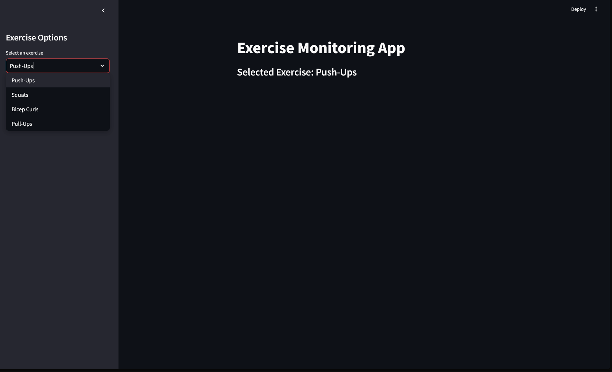
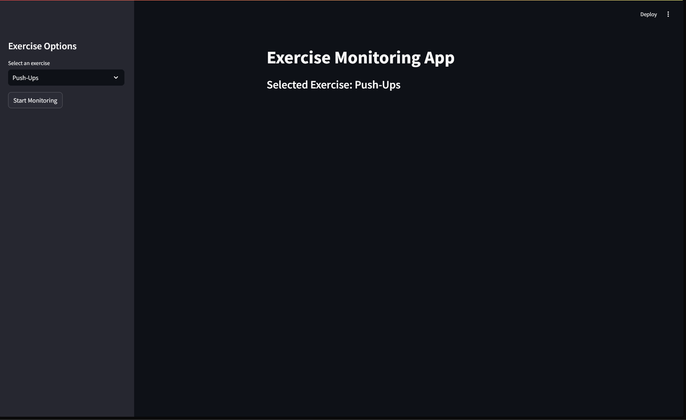
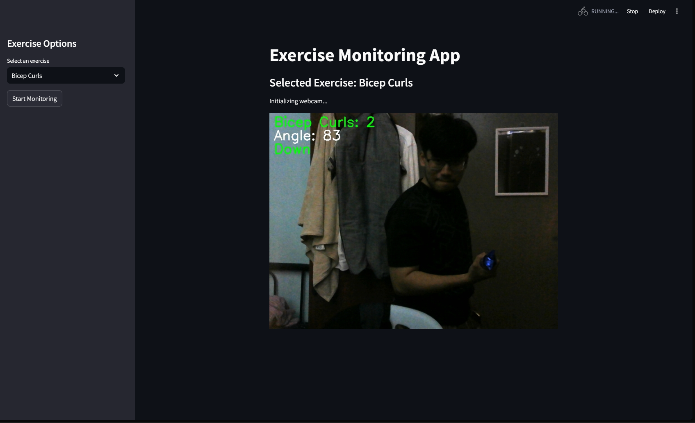

# Exercise Tracking Application

An AI-powered exercise monitoring system that uses computer vision to track and count various exercises in real-time for Practical AI Assignment.

## Group Members

- 22059211 - Ade Aiman Arief Bin Shamsuri
- U2000428 - Muhammad Shafiq Aiman Bin Nu Mahamad @ Marzuki
- U2102084 - Airisa Hani Binti Mohd Endan
- U2102083 - Airina Hani Binti Mohd Endan

## Features

- Real-time exercise form detection and counting
- Support for multiple exercises:
  - Push-ups
  - Pull-ups
  - Squats
  - Bicep curls
- Visual feedback on exercise form
- Angle calculations between body joints
- Rep counting with up/down state detection
- Web interface using Streamlit

## Screenshots






## Requirements

- Python 3.9+
- Webcam access

## Installation

1. Clone the repository
2. Install dependencies:

```bash
pip install -r requirements.txt
```

## Usage

To run the application:

```bash
streamlit run app.py
```

This will start a local web server, and you can access the application by navigating to `http://localhost:8501` in your web browser.

Then:
1. Select an exercise from the sidebar
2. Click "Start Monitoring" 
3. Position yourself in view of the webcam
4. Begin exercising

The application will automatically:
- Track your form
- Count repetitions
- Display real-time feedback

## Technical Details

Built using:
- MediaPipe for pose estimation
- OpenCV for image processing
- Streamlit for the web interface
- NumPy for mathematical calculations
